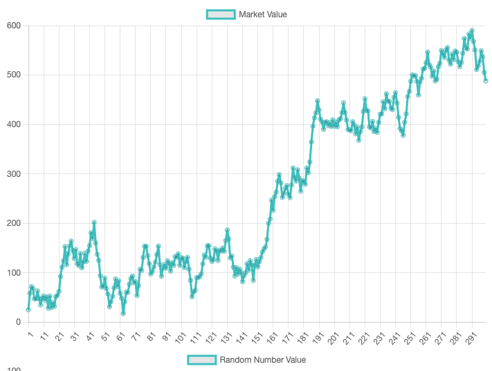

# marketApp

This is the market app that is a project for market analysis

# Outline

## Create a viable Dataset

I made a function to produce the data that I will be testing the app with.

The function produces a new random data set each time I run it. And I am  
able to get a full range of datasets with this function.

## Create the App

Now I need to make the app that will take a amount of money to be invested  
and then either buy or sell a percentage when the market goes up or down  
respectively.

The idea behind the app is that it works off of percentages. If the market  
goes down a little, you use a small percentage of the money invested to buy  
some stock. Likewise if the market goes up, then you will sell a small  
percentage of the amount that is currently invested.

## Aspects

Ok so I have the data as a JS object that I can work with. Now I need to write a function that processes the data.

the function will need to iterate through the data,
There needs to be an initial amount of money to invest.
We need to capture the last five or ten data points and use them as reference

compare the current value to the average of the values stored
There needs to be at least five data points, to compare to.

Where is the area where slight changes would effect how much money is made?

The objective is, taking in a random trending dataset how can you buy and sell to make the most money?

The most important data points will be the relative top and bottom of the market. And maybe this will change with time.

The aspect that will make or break the app is the percentage of the money that is invested. Sure the market will always go up and down but What you, or the app, has control over is what percentage of the total investment is either bought or sold at any given moment. And that will be determined by how much the market has gone up or down and relationship of the current price to the local high or low.

### Money to Invest

### Ratio of Percentages

### What happens when the majority of the money is invested?
